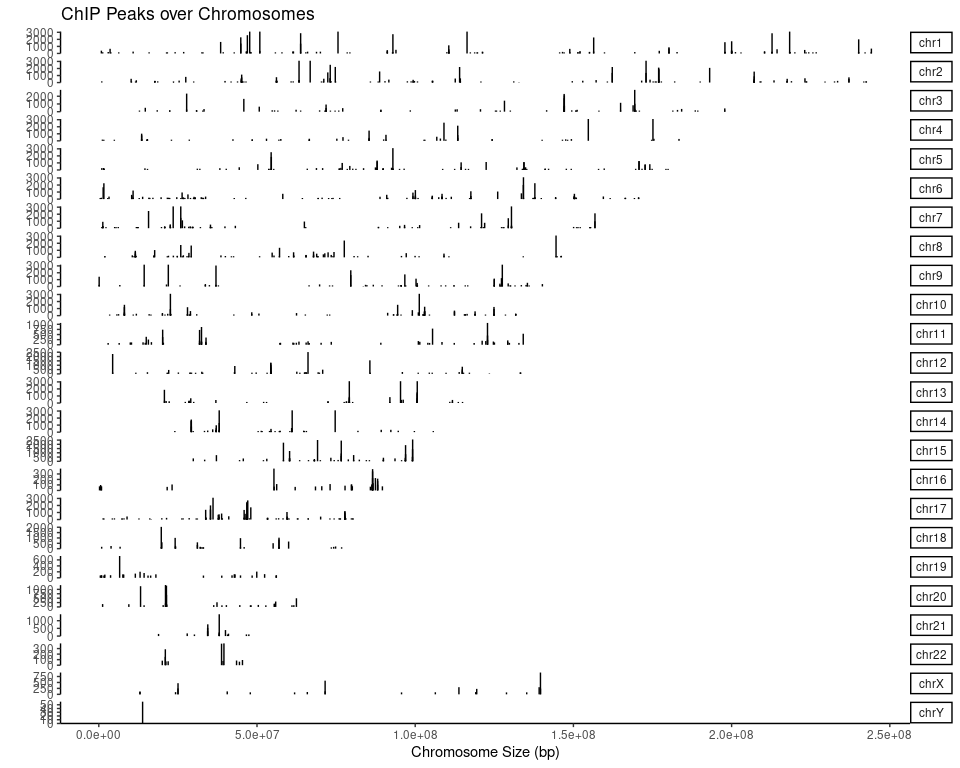
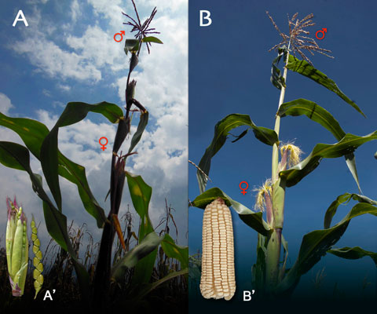

```{r setup, include=FALSE}
knitr::opts_chunk$set(echo = TRUE)
```
## Objetivo general

El objetivo de esta unidad es que te familiarices con R y que adquieras las habilidades básicas que te permitan manipular y limpiar datos en R, realizar gráficos y utilizar paquetes desarrollados en R.

## Objetivos particulares

- Comprenderás la diferencia entre R y Rstudio
- Comprenderás que es un objeto
- Conocerás los tipos de objetos existen en R
- Comrenderás que son son los paquetes o biblioteca de R
- Al final de esta sesion debes ser capaz de  crear objetos,  cargar archivos en R,  instalar librerias y  si nos da tiempo podrás hacer tu primer gráfico en R.

## R y RStudio

R es un lenguaje de programación enfocado en el análisis estadístico, desarrollado por Robert Gentleman y Ross Ihaka del Departamento de Estadística de la Universidad de Auckland en 1993.

RStudio es una aplicacion (add-on) que emplea R para desarrollar software. R puede ser usado sin RStudio, pero no RStudio no puede ser usado sin R.

## ¿Por qué usar R?

1. La descarga y el uso de R son libres. 
- A diferencias de otros softwares como SAS y SPSS que son costosos, R es facil de instalar en los tres sistemasopertaicos mas comunes: Windows, Mac y Linux
- R es ligero en comparacion con otros softwares.

2. R es open-source

- Lo anterior implica que el codigo esta disponible, y puede ser modificado por los usuarios para expandir sus funciones, mediante el uso de aplicaciones (add-ons) llamados paquetes o bibliotecas.
- Las capacidades de R estan en continua expansion. 

3.  El procesamiento de datos es sencillo.

- Es posible importar conjuntos de datos producidos por otros programas como Excel, SAS o SPS, y producir subconjuntos de datos..

4. Los archivos de salida producidos por R son faciles de compartir: graficos, tablas de datos o proyectos de RStudio.

5. Reproducibilidad. Debido a que los analisis  realizados con R se basan en *scripts* son faciles de compartir y reproducir...a veces.

6. La vasta gama de herramientas para visalizar datos.




## Kit basico de supervivencia en R


# Objetos en R 
La información que manipulamos en R se estructura en forma de objetos. Para trabajar con R resulta importante conocer los principales tipos de objetos y sus propiedades básicas. En general, cada tipo de objeto viene definido por una serie de atributos. Las funciones genéricas (como por ejemplo summary o plot) reconocen estos atributos y llevan a cabo distintos tipos de acciones en función del tipo de objeto [Rpubs](https://rpubs.com/joser/objetos). 


## Tipos de objetos:

Existen 5 tipos de objetos principales en R:

1. Vectores
2. Factores
3. Matrices
4. Listas
5. Data Frames

## 1. Vectores

- Tipo:  Son la estructura de datos más sencilla de R. Un vector tiene el mismo tipo que los datos que contiene. Si tenemos un vector que contiene datos de tipo numérico, el vector será también de tipo numérico. Si contiene caracteres sera de tipo...¿ ?

- Largo: Es la única dimension que tiene, es decir no tiene columnas o filas.

- Atributos:  Pueden tener metadatos de muchos tipos, los cuales describen características de los datos que contienen.

*Ejercicio 1. Crear un vector númerico*

```{r}
numerico <- 7460
print(numerico)  
```

# Exploremos sus atributos
```{r}
is.vector(numerico)
length(numerico)
```

¿Por qué la longitud de numérico es 1 si contiene tres dígitos?

Podemos crear vectores de mas de un elemento con la funcion combinar = c(), o agregar nuevos elementos a un vector existente

```{r}
numerico <- c(numerico, 707)
print(numerico)
length(numerico)
```

También existen vectores de texto:
*Ejercicio 2: Crear vector de texto*
```{r}
#Ingredientes de unas enchiladas
enchiladas <- c("salsa","tortillas","pollo","queso","crema", "aguacate")
is.vector(enchiladas)

#Pero ¿de qué clase?
class(enchiladas)
print (paste0("Enchiladas es un vector de tipo: ", class(enchiladas)))

```

Otra clase son los vectores de tipo lógico que  representan valores de lógica binaria, 2 valores, que normalmente representan falso o verdadero.

```{r}
print(enchiladas)
con.todo <- c(TRUE, TRUE, TRUE,TRUE, FALSE, FALSE)
print (paste0("con.todo es un vector de tipo: ", class(con.todo)))

```

¿Qué sucede si combinamos vectores de dos tipos?
```{r}
orden <- c(enchiladas, con.todo)

cuenta <- c(enchiladas, numerico)

# Cual es la clase de orden? vector o boleano
class(orden)
class(cuenta)

#Vamos a echar un vistazo
View(orden)
View(cuenta)
```
Por que cambia la clase de de *con.todo* y de la *cuenta*?

*Ejercicio 3: Crear un vector de tipo logico*

Crea un  vector de tipo character,  de tipo numérico y otro lógico, con una longitud >1. Todos deben de tener la misma longitud.

```{r}
concha <- "nata" # Esta es una concha con nata del Cardenal
concha
peso <- 10
peso
sabor <- TRUE


```

2. Matrices
Las matrices son también vectores pero con dos atributos adicionales: número de filas y número de columnas. Sin embargo, los vectores no son matrices con una fila o con una columna  [Rpubs](https://rpubs.com/joser/objetos). . 

Vamos a crear una matriz
*Ejercicio 4: Crear una matriz*
```{r}
matrix(data = 1:100, nrow = 10, ncol = 10)
# Podemos y lo ideal es que ASIGNEMOS la matriz a un objeto
kaputt <- matrix(data = 1:100, nrow = 10, ncol = 10)
dim(kaputt)

#Podemos sumar vectores a una matriz y concatenarlos. ¿Cuál es la diferencia?

fertig <- c(501:510)
kaputt <- kaputt + fertig

kaputt <-c(kaputt,fertig)
class(kaputt)
View(kaputt)

```

3. Listas
Una lista es un vector de objetos de distinta clase, que usualmente guaradan una relación. 
*Nota:* es importante conocer las propiedades de las listas, en mas de una ocasión las paqueterias de R nos devuelven resultados en formas de listas ej.: Listas de listas, listas de matrices, listas de data frames, etc.

Ejercicio 5: Crea una lista llamada phylogeny, explora sus elementios y extrae el elemento con índice 3.
```{}

phylogeny <- list(species = "Zea", no.subspecies = 4, names = c("Z. mays ssp. mays", "Z. mays ssp. parviglumis", "Z. mays ssp. mexicana", "Z. mays ssp. huehuetenanguensis" ))

#Revisa la estrutura de la lista que acabamos de crear
str(phylogeny)
```

- Utilizamos el signo '$' para acceder a cada de los objetos de la lista.
- Con los parentesis cuadrados '[]' podemos accceder a una posicion de cada elemento

 Ejemplo:
 milista$n.objeto[n.index]

Ejercicio: Extrae el segundo elemento del objeto names. Los parientes silvestres de maiz son conocidos genericamente como Teocintles, el segundo elemento del objeto names es la especie reconocida como el ancestro del maiz.


# Data frames

Las data frames, o tablas de datos. Son estructuras de datos de dos dimensiones: **filas y columnas**. La belleza de las datas frames radica en que pueden albergar datos de  diferente clase, como las listas, pero son bidimensionales. Técnicamente son listas  que combinan vectores  (columnas) con las misma longitud.


*Ejercicio 5: Crear una data frame*
```{r}
#Crearemos una data frame con los pesos  de 10 ratones con dos genotipos:  Geneticamente modificado (GM) y Sin modificacion genetica (Non-GM)

peso <- matrix(rnorm(10,mean = 40, sd = 10))
head(peso)
genotype <- c(rep("Non-GM", 5), rep("GM",5))

#Para crear una data frame unimos dos vectores con longitudes iguales y usamos el comando data.frame
mice <- data.frame(peso,genotype)
View(mice)

#Podemos explorar la estructura de la data frame
str(mice)


```

*Ejercicio 6: Explorar y crear subconjuntos de una data frame*

¿Cómo podemos acceder a los objetos de la data frame?
 Para acceder a las columnas o vectores que integran una data frame empleamos el simbolo *$*.

# Ejercicio 6.1 : 
1. Reflexiona  sobre que tipo de informacion guardarias en una lista, en una matriz en una data frame? ¿Cual consideras el objeto mas versatil o tu favorito? El mio es la data frame,  es altamente versatil y permite albergar informacion mixta, puedes hacer un subset y convertirlas en matrices  o en listas.

2. Crea una lista con al menos  10 elementos. a) Extrae el elemento 12 de la siguiente lista, 

## Cargar archivos en R

Existen 3 funciones basicas para la lectura de datos estructurados:comma-separated values (cvs),  tab-separated values(tsv)oO archivos de texto delimitados por  espacios sencillos u otros carácteres (txt). Si dominas una, dominaras el resto, mi favorita es *read.delim()*

read.table()
read.csv()
read.delim()

Los datos se alojan en su memoria. Si el set datos esta en el orden de Gb, tu computadora puede crashear


## Cargar archvivos via Rstudio

*Ejercicio 7 o Tarea:*
Es posible cargar archivos en R via Rstudio con el menu *Import Dataset*, pero no  se los aconsejo XD.
Mejor acostumbrarse a uno de las tres funciones básicas.


```{r}
maices.bonitos <- read.delim("../meta/landraces-subset.txt", header = T)

```
b) las primeras tres filas y columnas de la matriz  'Mushito',  y c) Extrae unicamente las filas para la raza'Chalqueno'
```


Ve al repositorio de GitHub del [FiveThirtyEight](https://fivethirtyeight.com/features/complete-catalog-curses-deaths-quentin-tarantino-films/) y descarga el set de datos del número de veces que maldicen en las películas de [Tarantino](https://github.com/fivethirtyeight/data/blob/master/tarantino/tarantino.csv) y guardalo en el directorio ..\data. Puedes usar el comando wget de bash

```{bash}
 wget https://github.com/fivethirtyeight/data/blob/master/tarantino/tarantino.csv
```

## Rscripts

Ejercicio 8: ¿Que es un script?
a) Los scripts de R se pueden crear con el File > New File > R script. Explora el menú y crea tu primer ejercicio con el comando
```{r}
print("Hello world!")
```


**¡Felicidades, ahora eres capaz de escribir código en R!**


